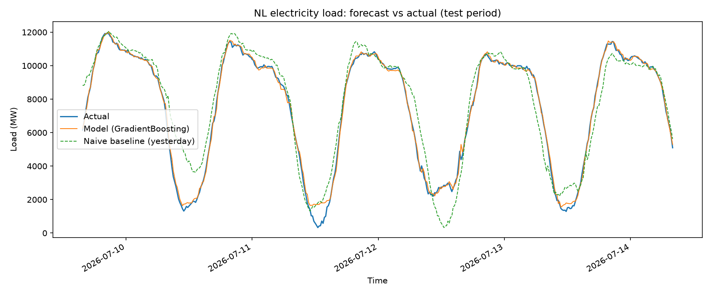
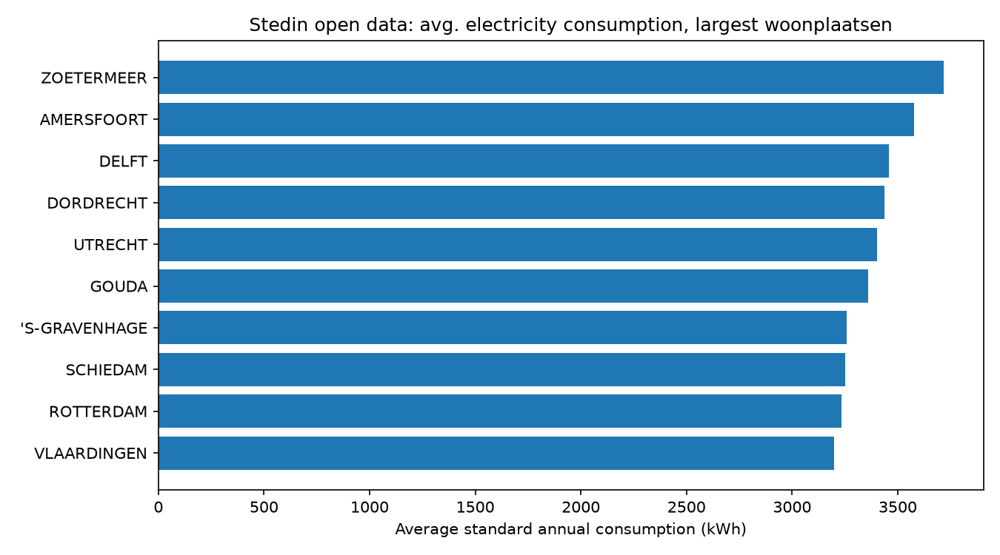

# Stedin Load Forecast Demo

Short-term electricity load forecasting, built as a small, production-minded demo for a Data Scientist interview at Stedin.

**Status:** working end-to-end pipeline, built 2026-07-14.

## Problem

Stedin's Data Science team forecasts load over time on transport and distribution networks to plan capacity and manage congestion. This repo demonstrates a small end-to-end forecasting pipeline for that class of problem, built with an emphasis on clean, testable, CI-backed code rather than notebook sprawl.

## Data

- **Core:** electricity load data for the Netherlands from [energy-charts.info](https://energy-charts.info) (Fraunhofer ISE), via the `public_power` endpoint's `"Load"` series — ~15-minute resolution, no registration required, CC BY 4.0. Fetched by `stedin_load_forecast.energy_charts.fetch_load()`.
- **Context:** Stedin's own open consumption data ([stedin.net/zakelijk/open-data](https://www.stedin.net/zakelijk/open-data)), CC-BY 4.0, used for a supporting visual rather than as a forecasting target (it's yearly and postcode-aggregated, not a time series).

## Approach

- **Features:** calendar features (hour, day-of-week, weekend flag) and lag features (15min/1h/1day/1week back) — load is dominated by daily and weekly seasonality, so these carry most of the signal. See `stedin_load_forecast.features`.
- **Baseline:** seasonal-naive — predict the same value as the same time one day ago (`lag_96`). Any real model needs to beat this to be worth the complexity.
- **Model:** `GradientBoostingRegressor` (scikit-learn) on the feature set above. Chosen over a heavier time-series-specific approach (ARIMA, Prophet) because it's simpler to productionize, easy to extend with new features, and a standard, defensible choice for this class of problem.
- **Validation:** chronological train/test split (no shuffling — this is time series, so no leaking future into the past). See `stedin_load_forecast.model.time_train_test_split`.
- **Metrics:** MAE, RMSE, MAPE, always reported against the naive baseline for context.

## Project structure

```
src/stedin_load_forecast/   # importable package — pipeline logic lives here, not in notebooks
scripts/run_pipeline.py     # CLI entry point
tests/                       # pytest suite
.github/workflows/           # CI: lint + test on push
docs/                        # example output images referenced in this README
data/raw/                    # gitignored — cached downloads (Stedin open data)
```

## Setup & run

Requires [`uv`](https://docs.astral.sh/uv/).

```
uv sync --group dev
uv run pytest
uv run python scripts/run_pipeline.py --days 30
```

This fetches the last 30 days of NL load data, trains the model, evaluates it against the naive baseline, and writes `outputs/forecast_comparison.png`.

### Example result

Run against live data on 2026-07-14 (30 days, NL):

| | MAE (MW) | RMSE (MW) | MAPE |
|---|---|---|---|
| Naive baseline (yesterday) | 779.3 | 1071.9 | 25.8% |
| Model (GradientBoosting) | **159.6** | **258.7** | **8.7%** |



### Stedin open-data chart

The same run also produces a chart from Stedin's own published open data (average annual electricity consumption for the woonplaatsen with the most connections in the dataset):



To skip this step (e.g. to avoid the ~4MB download): `uv run python scripts/run_pipeline.py --skip-garnish`.

## Testing

```
pytest
```

## CI

GitHub Actions runs lint and tests on every push. See `.github/workflows/`.

## Logging

`stedin_load_forecast.logging_config.configure_logging()` sets up two outputs:

- **Console**: the full run narrative at INFO level.
- **`logs/pipeline.log`** (gitignored): only WARNING and above — an at-a-glance record of problems, not a full transcript. Same severity hierarchy as Python's `logging` module: WARNING < ERROR < CRITICAL.

## Production next steps

This demo intentionally stops short of a full production setup (no OTAP environments, no A/B testing infrastructure, no feature store) — those are discussed as part of the interview rather than simulated here, to keep the demo itself proportionate to what it's actually demonstrating.
