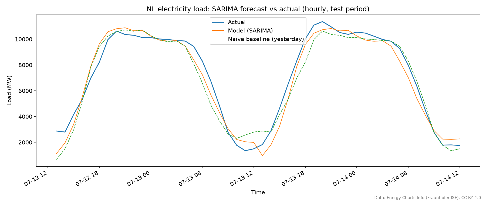

# Stedin Load Forecast Demo


Short-term electricity load forecasting for the Netherlands, built as a small, production-minded reference implementation of the kind of problem Stedin's Data Science team works on. The point of this repo isn't to be the most sophisticated model possible — it's to be a complete, honest example of the whole loop: real public data in, a defensible model out, validated against a baseline, wrapped in tests/CI/logging so someone else could pick it up and trust it.

## Overview

Stedin (and grid operators generally) need to forecast electricity load on their networks to plan capacity and manage congestion. This repo tackles a scaled-down version of that problem: given historical grid load for the Netherlands, forecast near-term load and prove the forecast is actually useful (i.e. it beats the trivial "assume tomorrow looks like today" baseline).

Everything here follows one guiding principle: **proportionate engineering**. Every piece of infrastructure (tests, CI, logging, caching) solves a real problem this specific project has — nothing was added because it would look impressive. Where a "real" production system would need more (a feature store, A/B testing, blue/green deploys), that's called out explicitly rather than half-simulated. See [Design decisions](#design-decisions) and [Production next steps](#production-next-steps).

## Architecture — where to find what

The package (`src/stedin_load_forecast/`) is organized as one module per responsibility. Each module is independently testable and (mostly) has no idea the others exist — `pipeline.py` is the only place that wires them together in order.

| Module | Responsibility | Key functions |
|---|---|---|
| `energy_charts.py` | Fetch NL grid load from the energy-charts.info API | `fetch_load()` |
| `stedin_open_data.py` | Fetch/parse Stedin's own open consumption data | `download_consumption_data()`, `top_woonplaatsen_by_connections()` |
| `features.py` | Turn raw load data into model features | `build_features()`, `feature_columns()` |
| `model.py` | Train the models (GradientBoosting, SARIMA), compute the naive baseline, evaluate all | `train_regressor()`, `train_sarima()`, `seasonal_naive_predict()`, `evaluate()` |
| `pipeline.py` | Orchestrate the above into one end-to-end run | `run_pipeline()` |
| `visualize.py` | Turn results into PNGs | `plot_forecast_comparison()`, `plot_top_woonplaatsen()` |
| `logging_config.py` | Console + file logging setup | `configure_logging()` |

`scripts/run_pipeline.py` is the CLI — it's a thin wrapper around `pipeline.run_pipeline()`, so the same logic is exercised whether you run it from the command line, from a test, or (eventually) from a scheduler.

Every module above has a module-level docstring explaining not just *what* it does but *why* it's built the way it is — that's the first place to look before reading the code itself.

## Data

- **Core (forecasting target):** electricity load for the Netherlands from [energy-charts.info](https://energy-charts.info) (Fraunhofer ISE), via the `public_power` endpoint's `"Load"` series — ~15-minute resolution, free, no registration. Chosen over ENTSO-E's own Transparency Platform (the "official" source) because ENTSO-E requires emailing them for API access before you can pull data programmatically; energy-charts.info mirrors the same grid data with zero friction. CC BY 4.0 (attribution is printed on the chart itself — see `visualize.ATTRIBUTION` usage).
- **Context (supporting visual, not a forecasting input):** Stedin's own open consumption data ([stedin.net/zakelijk/open-data](https://www.stedin.net/zakelijk/open-data)), CC BY 4.0. This is yearly, postcode-aggregated Standard Annual Consumption — one row per postcode range per year, not a time series — so it can't be a forecasting target. It's used for one chart (average consumption for Stedin's largest service-area woonplaatsen), to show the demo also engages with Stedin's own published data rather than only a generic third-party API.

## Approach

Two independent model comparisons run in this pipeline, at two different resolutions — see [Design decisions](#design-decisions) for why they're not combined into one.

- **Features** (`features.py`): calendar features (hour, day-of-week, weekend flag) and lag features (15min/1h/1day/1week back). Load is dominated by daily and weekly seasonality — these two cheap, interpretable feature families capture almost all of that structure without needing something heavier like Fourier terms. (Used by the GradientBoosting comparison only — SARIMA models the raw series directly.)
- **Baseline** (`model.seasonal_naive_predict`): predict the same value as the same time yesterday. Any model complex enough to need training has to prove it beats this — "8.7% MAPE" means little on its own, but "a third of the naive baseline's error" is immediately legible to a non-ML stakeholder. Each comparison gets its own naive baseline at its own resolution.
- **Model 1 — GradientBoosting** (`model.train_regressor`), 15-minute resolution: `GradientBoostingRegressor` (scikit-learn) on the calendar + lag features above. Chosen because it handles non-linear feature interactions without manual feature crosses, needs no feature scaling, and is a standard, easy-to-explain, production-idiomatic choice.
- **Model 2 — SARIMA** (`model.train_sarima`), hourly resolution: the classical statistical alternative, run as a direct comparison. `order=(0,0,0)`, `seasonal_order=(1,1,0,24)` — a pure seasonal AR(1) on seasonally-differenced data, no regular ARMA terms at all. That's an unusually minimal SARIMA configuration, and it's there for a concrete reason, not a guess: an "obvious" `(1,1,1)x(1,1,1,24)` was tried first and its forecast **diverged** over a multi-day horizon (predictions drifting to ~19,000 MW against an actual peak of ~12,000 MW) — a known double-differencing failure mode for long, single-shot ARIMA forecasts. A short empirical search found this minimal configuration both avoided the divergence *and* was the only one tested that consistently beat the naive baseline. See `model.py`'s module docstring for the full account.
- **Validation**: chronological, never random-shuffled (`model.time_train_test_split` for GradientBoosting — a fraction-based split; `model.split_last_n` for SARIMA — a fixed 48-hour holdout, not a fraction, because SARIMA's forecast accuracy degrades with horizon length, so it needs to be evaluated at a realistic operational horizon rather than whatever a 20%-of-fetched-data holdout happens to be). Random shuffling would leak near-future information into training via adjacent, highly-correlated rows and make reported accuracy look better than real deployment would.
- **Metrics** (`model.evaluate`): MAE, RMSE, and MAPE, always reported for both the model and its baseline side by side. Each metric answers a different question — see the docstring in `model.py` for the detail.

## Quickstart

Requires [`uv`](https://docs.astral.sh/uv/).

```bash
uv sync --group dev
uv run pytest
uv run python scripts/run_pipeline.py --days 30
```

This fetches the last 30 days of NL load data, trains both models, evaluates each against its own naive baseline, and writes `outputs/forecast_comparison.png`, `outputs/sarima_comparison.png`, and `outputs/top_woonplaatsen.png`. Skip the last chart (and its ~4MB download) with `--skip-garnish`.

### Example result

Run against live data on 2026-07-14 (30 days, NL):

**GradientBoosting, 15-minute resolution, 6-day test period:**

| | MAE (MW) | RMSE (MW) | MAPE |
|---|---|---|---|
| Naive baseline (yesterday) | 776.2 | 1069.3 | 25.9% |
| Model (GradientBoosting) | **160.8** | **254.7** | **8.7%** |


**SARIMA, hourly resolution, fixed 48-hour test period:**

| | MAE (MW) | RMSE (MW) | MAPE |
|---|---|---|---|
| Naive baseline (yesterday) | 637.8 | 856.1 | 15.1% |
| Model (SARIMA) | **585.9** | **705.6** | **13.5%** |



GradientBoosting's margin over its baseline is much larger than SARIMA's — worth being upfront about rather than glossing over. It reflects a genuine difference: the regressor gets rich lag + calendar features and a 15-minute-resolution training set an order of magnitude larger than SARIMA's hourly one, while SARIMA has to infer everything from the raw series alone. SARIMA still earns its place in the comparison — it's a real, working, better-than-naive result, reached by an honest empirical process (see [Approach](#approach)) rather than by tuning until a bigger number appeared.


## Project structure

```
src/stedin_load_forecast/   # importable package — see the architecture table above
scripts/run_pipeline.py     # CLI entry point (thin wrapper around pipeline.run_pipeline)
tests/                      # pytest suite, one test file per src module
.github/workflows/ci.yml    # CI: ruff + pytest on every push/PR
docs/                       # example output images referenced in this README
data/raw/                   # gitignored — cached downloads (Stedin open data)
outputs/                    # gitignored — chart output from running the pipeline
logs/                       # gitignored — logs/pipeline.log, see Logging below
```

## Design decisions

A quick-reference for the "why" behind the infrastructure choices, each expanded further in the relevant module's docstring:

- **uv + a committed `uv.lock`** for dependency management — fast installs, and the lockfile means "works on my machine" reproduces exactly on any other machine or in CI, not approximately.
- **Python pinned to 3.12** (`.python-version`) rather than whatever's newest on the build machine — avoids the risk of core data-science packages not yet having wheels for a brand-new interpreter version.
- **Chronological git history**: feature branches → `development` → `master`, each merged as a real merge commit (not squashed) with its own tests/docs/logging bundled in, each CI-verified before merging. The commit history itself is meant to be legible, not just the final code.
- **No OTAP, no A/B testing infrastructure, no feature store** in this repo — deliberately. Those solve problems a single-model demo with no real deployment target doesn't have; simulating them here would be complexity theatre, not engineering. See [Production next steps](#production-next-steps).
- **SARIMA's hyperparameters came from timing and accuracy actually measured on this data, not textbook defaults** — the "obvious" `(1,1,1)x(1,1,1,24)` config both takes 751s to fit at native resolution (vs. 3.9s hourly) and diverges over a multi-day forecast horizon. Both findings changed the design (hourly resolution; a minimal, empirically-chosen order; a fixed short evaluation horizon instead of the same split the regressor uses) rather than being footnoted after the fact. See `model.py`'s module docstring for the full account.
- **Three bugs/pitfalls caught during manual end-to-end runs, not by the unit tests** — worth calling out because it's a reminder that mocked-HTTP tests (and, for SARIMA, a fit that completes without error) can't catch everything:
  1. `logging.basicConfig()` silently no-ops on any call after the first, unless `force=True` is passed — caught by a test, fixed, now impossible to regress silently.
  2. `stedin.net` returns HTTP 403 for the default `python-requests` User-Agent (a WAF rule) — only surfaced by actually running the pipeline against live data. Fixed with a browser-like User-Agent header, now pinned by a test assertion so it can't quietly break again.
  3. SARIMA's forecast divergence above — a fit with no errors and no warnings that was nonetheless producing a badly wrong forecast; only visible by inspecting actual predicted values against actual outcomes, not by any automated check.

## Testing

```bash
uv run pytest
```

Every HTTP call is mocked (`responses` / `unittest.mock`) — the suite never touches the network, so it's fast and deterministic in CI. That's also why two of the three pitfalls above weren't caught by tests alone: they only show up when the pipeline actually talks to the real APIs (or, for SARIMA, produces a forecast worth actually looking at) — which is why running `scripts/run_pipeline.py` against live data was a required verification step, not just a demo nicety, at every stage of the build.

## Logging

`logging_config.configure_logging()` sets up two outputs, each with a different job:

- **Console** — the full run narrative at INFO level, for watching a run happen.
- **`logs/pipeline.log`** (gitignored) — only WARNING and above. Kept separate from the console stream so that checking "did anything go wrong" doesn't mean scanning past hundreds of routine INFO lines — the file itself *is* the alert list, following Python's standard severity hierarchy (WARNING < ERROR < CRITICAL).

## CI

GitHub Actions (`.github/workflows/ci.yml`) runs `ruff check` and `pytest` on every push and pull request against `development` and `master`, using `astral-sh/setup-uv` for fast, lockfile-exact installs. Every merge in this repo's history happened only after this went green.

## Production next steps

This demo intentionally stops short of a full production setup:

- **OTAP environments** — not simulated; there's no real deployment target for a single-model demo to move through.
- **A/B testing infrastructure** — not simulated; there's no live traffic to split.
- **Feature store / retraining pipeline** — not built; the data here is small enough that re-fetching and re-training from scratch each run is fine, which wouldn't hold at production scale.
- **Containerization** — not yet included (a bare `Dockerfile` was considered and deliberately deferred rather than added for completeness's sake with no corresponding need).

These are exactly the kind of decisions worth walking through in a conversation rather than half-building in a repo nobody will run in anger — over-building this demo to simulate all of them would itself be the kind of complexity this repo is trying to avoid.
